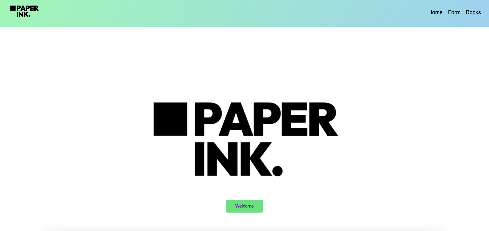
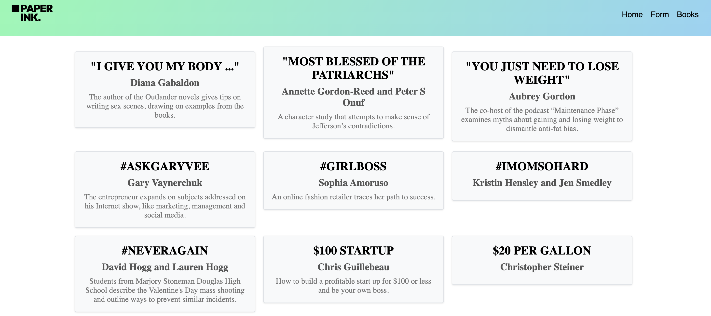

# React + Vite Books Website

Esta es una aplicación web de libros que permite a los usuarios ver una lista de libros, agregar nuevos libros mediante un formulario y navegar entre diferentes páginas. La aplicación adquiere los libros mediante una API.

## Características

- **Página de inicio**: Muestra el logo de la aplicación.
- **Formulario de libros**: Permite a los usuarios insertar nuevos libros.
- **Lista de libros**: Muestra una lista de libros obtenidos desde una API.
- **Navegación**: Permite a los usuarios navegar entre la página de inicio, el formulario y la lista de libros.
- **Responsivo**: La aplicación es responsiva y se adapta a diferentes tamaños de pantalla.

## Imagenes de la página
 ### Imagen de la portada de la página

 ### Imagen del formulario 
 

  ### Imagen de la librería
  

## Tecnologías Utilizadas

- React
- React Router DOM
- SCSS para estilos
- Context API para el manejo del estado global

## Autor

Jairo Núñez Fernandez

